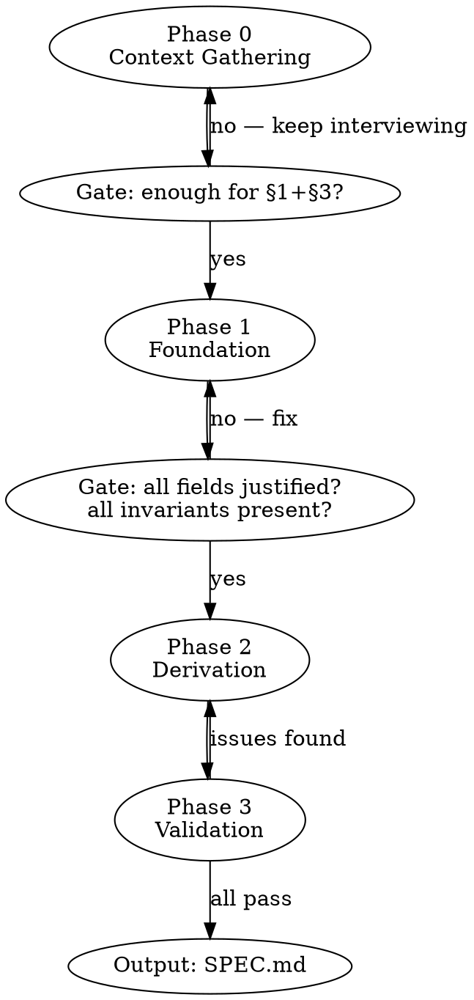

# Writing AI-First Design Documents

Produces a SPEC.md that maximises implementation quality when the implementer is an LLM.
The six target properties of the output code: **cleanliness, simplicity, observability,
testability, adaptability, best practices.**

Two modes: if source materials exist (presentations, docs, code) — extract first, then
interview only for gaps. If nothing exists — interview from scratch.

---

## Flow



---

## Phase 0 — Context Gathering

1. Scan all available materials: files, docs, presentations, previous conversation
2. Build a map — **known** vs **needs clarification**
3. Ask only about gaps — one question at a time, never re-ask what the materials already answer
4. Gate question before Phase 1: *"Do I know the goal, at least one architectural constraint,
   and at least one key entity?"* — if no, continue interviewing

---

## Phase 1 — Foundation

Write §1 and §3 before touching anything else. These are the base everything derives from.

### §1 — Project Overview

```markdown
## Overview

### Idea & Goal
One sentence: what this is and why it exists.

### Scope
- **In scope:** concrete items
- **Non-goals:** explicit exclusions  ← REQUIRED. Prevents LLM scope-creep.

### Architectural Requirements
What the system MUST satisfy (latency targets, consistency guarantees, throughput).

### Architectural Constraints
What the system MUST NOT do (no locks on hot path, no TLS, no dynamic allocation).
```

### §3 — Entities & Data Types

Every entity:

```markdown
### EntityName

| Field      | Type    | Justification (→ §1 requirement)          |
|------------|---------|-------------------------------------------|
| field_name | uint8   | reason tied to a specific §1 requirement  |

**Invariants:** what must always be true about this entity
**Relationships:** how it relates to other entities
```

Rules:
- Every field has a justification referencing §1 — no orphan fields
- Every entity has at least one invariant
- Wire format == in-memory format where possible — document if they differ

**Gate Phase 1 → Phase 2:**
- [ ] Every field justified against §1
- [ ] Every entity has invariants
- [ ] No entity without a purpose

---

## Phase 2 — Derivation

§4 and §5 are derived from §3. Every type in processes and contracts must reference
an entity from §3 or be a primitive. New types go back to §3 first.

### §4 — Processes & Functions

```markdown
### ProcessName

**Input:** `EntityType` — description
**Output:** `EntityType | void` — description
**Invariants:** what must hold before / during / after
**Side Effects:** what changes outside the function (file, queue, external state)

#### Functions

- `funcName(args) → return`
  - **What:** full description of what the function does — concrete, implementation-level.
    Cover edge cases, non-obvious behaviour, and any constraints the implementation must respect.
    Write enough that an LLM can implement the function correctly without guessing.
  - **Why:** why this function exists in this process and product context — which requirement,
    invariant, or business rule it serves. Explain consequences of getting it wrong.
```

Rules:
- Every Input/Output references §3 or a primitive — never an undefined type
- Every state-changing process has documented Side Effects (observability gate)
- Every process has at least one invariant (testability gate)
- No magic numbers — use named constants defined in §1 or §3
- Every function has **What** + **Why** with enough depth for correct implementation —
  a brief label is not sufficient; describe behaviour, constraints, and purpose in context

### §5 — Public Contract

Everything that crosses the system boundary. One format for all types
(protocol, REST, CLI, library API):

```markdown
### OperationName

**Direction:** Client → Server | Server → Client | bidirectional
**Format:** frame layout / endpoint / function signature
**Input:** field — type — description
**Output:** field — type — description
**Errors:** condition → error code/message
**Constants:** named constants used (no magic numbers)
```

Rules:
- Every operation calls at least one process from §4 — no orphan operations
- All constants are named — never inline literals
- Error cases are exhaustive

---

## Phase 3 — Validation Checklist

Run this before delivering the spec. Fix inline — do not report each issue to the user,
just fix and produce a clean result.

**Traceability:**
- [ ] Every §1 requirement addressed in §3, §4, or §5
- [ ] Every §3 entity used in at least one §4 process
- [ ] Every §5 operation calls at least one §4 process
- [ ] No orphan fields / entities / operations

**Six quality properties:**
- [ ] **Cleanliness** — no undefined types in process Input/Output
- [ ] **Simplicity** — no duplicate processes; all non-goals explicit in §1
- [ ] **Observability** — every state-changing process has Side Effects documented
- [ ] **Testability** — every process has Input, Output, and at least one Invariant; every function has What + Why
- [ ] **Adaptability** — no magic numbers anywhere; all constants named in §1 or §3
- [ ] **Best practices** — naming consistent, no implicit behaviour, zero ambiguity

**Completeness:**
- [ ] No TBD, TODO, or "to be clarified"
- [ ] All sections present: §1, §3, §4, §5 + TOC
- [ ] Non-goals explicitly listed in §1

---

## Output Format

File: `SPEC.md` in the project root (or user-specified path).

**§2 — MD Format + Table of Contents** is a structural requirement, not a content section:
the spec is always Markdown with a TOC linking all sections. Every spec must satisfy §2.

The TOC must be **three levels deep**: top-level sections → subsections → individual items (entities,
processes, operations). This lets an implementer jump directly to any entity or process without
scanning the document.

```markdown
# ProjectName — Specification

## Table of Contents

1. [Overview](#overview)
   - [Idea & Goal](#idea--goal)
   - [Scope](#scope)
   - [Architectural Requirements](#architectural-requirements)
   - [Architectural Constraints](#architectural-constraints)

2. [Entities & Data Types](#entities--data-types)
   - [EntityOne](#entityone)
   - [EntityTwo](#entitytwo)
   - [Named Constants](#named-constants)

3. [Processes & Functions](#processes--functions)
   - [ProcessOne](#processone)
   - [ProcessTwo](#processtwo)

4. [Public Contract](#public-contract)
   - [OperationOne](#operationone)
   - [OperationTwo](#operationtwo)

---
## Overview
...
## Entities & Data Types
...
## Processes & Functions
...
## Public Contract
...
```

Section map: §1=Overview · §2=MD+TOC (format constraint) · §3=Entities · §4=Processes · §5=Contract.

---

## Common Mistakes

| Mistake | Fix |
|---------|-----|
| Field without justification | Add "→ §1 req: X" to every field |
| Process with undefined Input type | Add entity to §3 first |
| Orphan operation in §5 | Link to process in §4 or remove |
| Magic number in contract | Name it as a constant in §1 or §3 |
| Missing non-goals | Always add Non-goals to §1 |
| Side effects undocumented | Any write to file/queue/state = Side Effect |
| TBD left in final doc | Fix before delivery, never leave open |
| Function with shallow What/Why | Descriptions must cover behaviour, constraints, and product context — not just a label |
